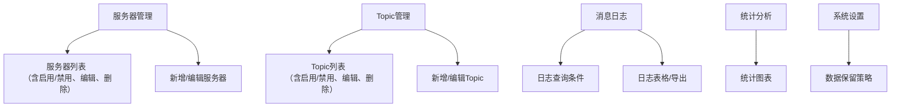

## MQTT订阅管理器产品需求与页面设计

### 一、产品需求概述
1. 支持配置多个MQTT服务器（地址、端口、账号、密码、TLS等）。
2. 每个服务器可配置多个订阅Topic，支持通配符。
3. 实时接收并存储所有订阅Topic的消息，消息内容包括：时间戳、服务器、Topic、消息内容、QoS、设备ID（如有）、消息方向（上行/下行）。
4. 消息日志可按服务器、Topic、时间段、关键字等多条件进行检索和分析。
5. 支持消息量统计、活跃Topic排行等基础分析。
6. 支持日志导出为CSV/Excel。
7. 提供简洁易用的Web界面（Vue3），无需权限管理。
8. 后端采用Python，数据库采用SQLite。

### 二、功能模块详细说明

#### 1. 服务器与Topic管理
- 支持添加、编辑、删除多个MQTT服务器配置（包括名称、地址、端口、账号、密码、TLS等参数）。
- 每个服务器可配置多个订阅Topic，支持通配符，支持批量添加。
- 支持对服务器和每个Topic的启用/禁用操作，禁用后不连接或不订阅。
- Topic与服务器关联，支持对单个服务器下Topic的独立管理。
- 服务器与Topic状态实时显示（如连接状态、订阅状态、启用/禁用状态）。

#### 2. 消息采集与存储
- 后端服务自动连接所有已配置并启用的MQTT服务器。
- 按配置订阅所有Topic，实时接收消息。
- 消息内容存储到SQLite数据库，字段包括：时间戳、服务器、Topic、消息内容、QoS、设备ID（如有）、消息方向（上行/下行）、原始报文等。
- 支持高并发消息写入，保证数据完整性。

#### 3. 日志查询与分析
- Web界面支持按服务器、Topic、时间段、关键字等多条件检索消息日志。
- 支持消息内容全文模糊检索。
- 查询结果支持分页、排序、内容复制。
- 支持基础统计分析，如消息量趋势、活跃Topic排行、设备活跃度排行等。

#### 4. 日志导出
- 查询结果可一键导出为CSV或Excel文件。
- 支持导出全部或部分字段，导出文件带查询条件说明。

#### 5. 统计分析（可选）
- 消息量趋势图：按天/小时统计消息数量，支持自定义时间范围。
- 活跃Topic排行：统计消息量最多的Topic。
- 设备活跃度排行：统计消息量最多的设备。

#### 6. 系统设置（可选）
- 数据保留策略：如自动清理历史数据，设置数据保留天数。
- 日志导出历史记录，便于追溯。

#### 7. 其他
- 支持系统运行状态监控（如MQTT连接数、消息速率等）。
- 支持基础异常告警（如服务器连接失败、消息堆积等）。

---

### 三、Web界面原型结构（优化版）

#### 1. 整体布局

```
┌──────────────────────────────────────────────┐
│ 顶部导航栏（系统名称、Logo）                │
├───────────────┬────────────────────────────┤
│ 侧边栏菜单    │ 主内容区（随菜单切换页面） │
│  ┌─────────┐ │                            │
│  │服务器管理│ │                            │
│  │Topic管理 │ │                            │
│  │消息日志  │ │                            │
│  │统计分析  │ │                            │
│  │系统设置  │ │                            │
│  └─────────┘ │                            │
├───────────────┴────────────────────────────┤
│                底部版权信息（可选）         │
└──────────────────────────────────────────────┘
```

主要交互说明：
- 服务器/Topic列表均有“启用/禁用”开关，状态一目了然。
- 启用服务器后自动连接，禁用则断开。
- 启用Topic后自动订阅，禁用则取消订阅。

#### 2. 页面结构关系与交互示意



说明：
- 服务器和Topic列表均有启用/禁用按钮，状态实时反馈。
- 主要页面均可通过侧边栏菜单切换。

#### 3. 主要页面功能说明
- 服务器管理：服务器列表、添加/编辑/删除服务器
- Topic管理：Topic列表、添加/编辑/删除Topic
- 消息日志：条件检索、日志表格、导出
- 统计分析：消息量趋势、活跃Topic排行、设备活跃度
- 系统设置：数据保留策略、导出历史

---

### 四、主要页面与表单字段建议

#### 1. 新增/编辑服务器表单
- 服务器名称（必填）
- 地址（必填，IP或域名）
- 端口（必填，默认1883/8883）
- 用户名（可选）
- 密码（可选，密码框）
- 是否启用TLS（开关）
- 备注（可选）

#### 2. 新增/编辑Topic表单
- 所属服务器（下拉选择，必填）
- Topic名称（必填，支持通配符）
- 备注（可选）

#### 3. 日志查询条件区
- 服务器（下拉选择，必填）
- Topic（多选下拉，必填）
- 时间范围（起止时间选择器，必填）
- 关键字（输入框，模糊搜索消息内容，可选）

#### 4. 日志展示区
- 表格展示：时间戳、服务器、Topic、消息内容、QoS、设备ID、方向
- 支持分页、排序、复制消息内容
- 支持导出当前查询结果为CSV/Excel

#### 5. 统计分析区（可选）
- 消息量趋势图（按时间段统计）
- 活跃Topic排行（柱状图/饼图）
- 设备活跃度排行

#### 6. 其他交互细节
- 所有表单支持校验与提示
- 操作需有确认弹窗（如删除）
- 日志表格支持内容展开/折叠
- 支持响应式布局，兼容大屏和常规PC
