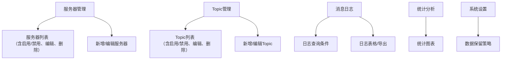

## 九、UI设计风格参考

本系统UI设计建议参考下图风格（见附件截图）：

- 整体采用简洁、现代的管理后台风格，顶部蓝色导航栏，左侧浅色侧边栏，主内容区为白色卡片式布局。
- 列表页采用大表格展示，表头固定，支持横向滚动，表格内容居中或左对齐，重要字段加粗。
- 查询区采用横向排列的输入框、下拉框、日期选择器，右侧有查询和重置按钮。
- 操作列统一放在表格最右侧，常用操作（详情、编辑、删除、手动触发等）以文字按钮或图标按钮展示。
- 启用/禁用采用明显的开关控件，状态一目了然。
- 支持分页，分页控件居右。
- 颜色搭配以蓝色、白色、灰色为主，按钮和高亮字段用主色突出。
- 表格支持悬浮高亮、内容溢出省略号、鼠标悬停显示全部内容。
- 顶部导航栏可放系统名称、Logo、用户信息等。
- 侧边栏菜单分组清晰，支持收起/展开。
- 整体风格与Element Plus、Ant Design Pro等主流后台UI框架风格一致，便于快速实现。

如需详细UI原型图或组件代码，可进一步补充说明。
# MQTT订阅管理器设计说明书

## 一、系统架构

- 前端：Vue3 + Element Plus（或Ant Design Vue），SPA管理后台
- 后端：Python（FastAPI/Flask，推荐FastAPI，异步支持好）
- 数据库：SQLite（可扩展为MySQL/PostgreSQL）
- MQTT客户端：paho-mqtt（Python库）
- 通信协议：RESTful API（前后端分离）

### 架构图
```
[前端(Vue3)] ←→ [后端API(Python)] ←→ [SQLite数据库]
                               ↑
                        [MQTT客户端]
```

---

## 二、数据库设计

### 1. mqtt_server（MQTT服务器配置表）
| 字段名     | 类型      | 说明         |
| ---------- | --------- | ------------ |
| id         | INTEGER PK| 主键         |
| name       | TEXT      | 服务器名称   |
| host       | TEXT      | 地址         |
| port       | INTEGER   | 端口         |
| username   | TEXT      | 用户名       |
| password   | TEXT      | 密码         |
| tls        | BOOLEAN   | 是否启用TLS  |
| enabled    | BOOLEAN   | 是否启用     |
| remark     | TEXT      | 备注         |
| created_at | DATETIME  | 创建时间     |
| updated_at | DATETIME  | 更新时间     |

### 2. mqtt_topic（订阅Topic表）
| 字段名     | 类型      | 说明         |
| ---------- | --------- | ------------ |
| id         | INTEGER PK| 主键         |
| server_id  | INTEGER FK| 所属服务器   |
| topic      | TEXT      | Topic名称    |
| enabled    | BOOLEAN   | 是否启用     |
| remark     | TEXT      | 备注         |
| created_at | DATETIME  | 创建时间     |
| updated_at | DATETIME  | 更新时间     |

### 3. mqtt_message（消息日志表）
| 字段名     | 类型      | 说明         |
| ---------- | --------- | ------------ |
| id         | INTEGER PK| 主键         |
| server_id  | INTEGER FK| 来源服务器   |
| topic      | TEXT      | Topic名称    |
| payload    | TEXT      | 消息内容     |
| qos        | INTEGER   | QoS          |
| device_id  | TEXT      | 设备ID       |
| direction  | TEXT      | 上行/下行    |
| raw        | TEXT      | 原始报文     |
| timestamp  | DATETIME  | 消息时间     |
| created_at | DATETIME  | 入库时间     |

---

## 三、主要接口设计（RESTful）

### 1. 服务器管理
- GET /api/servers           查询服务器列表
- POST /api/servers          新增服务器
- PUT /api/servers/{id}      编辑服务器
- PATCH /api/servers/{id}/enable   启用/禁用服务器
- DELETE /api/servers/{id}   删除服务器

### 2. Topic管理
- GET /api/topics?server_id= 查询Topic列表
- POST /api/topics           新增Topic
- PUT /api/topics/{id}       编辑Topic
- PATCH /api/topics/{id}/enable    启用/禁用Topic
- DELETE /api/topics/{id}    删除Topic

### 3. 消息日志
- GET /api/messages?server_id=&topic=&keyword=&start=&end=&page=&size=   查询消息日志
- GET /api/messages/export   导出日志（CSV/Excel）

### 4. 统计分析
- GET /api/stat/message_trend   消息量趋势
- GET /api/stat/topic_rank      活跃Topic排行
- GET /api/stat/device_rank     设备活跃度排行

---

## 四、前端页面结构

- 服务器管理页：列表、添加/编辑、启用/禁用、删除
- Topic管理页：列表、添加/编辑、启用/禁用、删除
- 消息日志页：条件检索、表格展示、导出
- 统计分析页：趋势图、排行图
- 系统设置页：数据保留策略、导出历史

---


## 五、关键业务流程

### 1. 服务器与Topic启用/禁用
- 启用服务器：后端自动连接MQTT服务器，订阅所有启用Topic
- 禁用服务器：断开连接，所有Topic自动停止订阅
- 启用Topic：对已连接服务器动态订阅该Topic
- 禁用Topic：动态取消订阅

### 2. 消息采集与存储及上下行判别
- MQTT客户端监听所有启用服务器和Topic
- 收到消息后，自动判别消息方向（上行/下行），并写入mqtt_message表
       - 判别逻辑：
              1. 推荐采用Topic命名规范自动判别。例如：
                      - Topic包含“/up”或“/data”或“/report”视为上行（设备→云平台）
                      - Topic包含“/down”或“/cmd”或“/set”视为下行（云平台→设备）
              2. 若Topic命名不规范，可在订阅配置中手动指定方向。
              3. 方向字段（direction）存储为“上行”或“下行”。

### 3. 日志查询与导出及方向标记
- 前端传递检索条件，后端分页返回数据
- 日志表格展示时，增加“方向”字段，清晰标记每条消息为“上行”或“下行”
- 导出时也包含方向字段，便于后续分析

---

## 六、异常与日志处理

- 服务器连接失败、消息堆积等异常，前端弹窗或状态提示
- 后端记录操作日志、错误日志，便于排查

---

## 七、部署建议

- 推荐Docker部署，便于环境一致性
- 支持Windows/Linux
- 数据库文件定期备份

---

---

## 八、前端页面原型

### 1. 整体布局

```
┌──────────────────────────────────────────────┐
│ 顶部导航栏（系统名称、Logo）                │
├───────────────┬────────────────────────────┤
│ 侧边栏菜单    │ 主内容区（随菜单切换页面） │
│  ┌─────────┐ │                            │
│  │服务器管理│ │                            │
│  │Topic管理 │ │                            │
│  │消息日志  │ │                            │
│  │统计分析  │ │                            │
│  │系统设置  │ │                            │
│  └─────────┘ │                            │
├───────────────┴────────────────────────────┤
│                底部版权信息（可选）         │
└──────────────────────────────────────────────┘
```

### 2. 页面结构与交互关系



### 3. 主要页面功能说明

- 服务器管理：服务器列表（含启用/禁用、编辑、删除）、新增/编辑服务器弹窗
- Topic管理：Topic列表（含启用/禁用、编辑、删除）、新增/编辑Topic弹窗
- 消息日志：条件检索区、日志表格（含方向标记）、导出按钮
- 统计分析：消息量趋势图、活跃Topic排行、设备活跃度排行
- 系统设置：数据保留策略、导出历史

### 4. 交互细节建议

- 所有列表均支持分页、筛选、排序
- 启用/禁用操作为开关按钮，状态实时反馈
- 日志表格方向字段高亮显示“上行”或“下行”
- 支持表格内容复制、导出
- 表单支持校验与错误提示
- 支持响应式布局，兼容大屏和常规PC
