# 《能源管家》产品需求说明书V1.0

> 确认日期：2025年6月20日  
> 版本号：V1.0

## 一、产品概述

能源管家是一套基于物联网和大数据的能耗监测与管理平台，实现对水、电、气、热等多能源的实时采集、分析、优化和可视化，助力企业降本增效与绿色发展。

## 二、详细功能需求

### 1. 项目用能

#### 1.1 用能概况

- 页面分为左侧导航栏、顶部项目切换栏、主内容区三部分。
- 分类能耗统计卡片：
  - 展示电、水、碳排放三类能耗，分别显示今日、本月、本年数据。
  - 每项能耗卡片包含：本期数值、环比/同比百分比、上期（昨日/上月/去年同期）数值。
  - 数值单位：电（kWh）、水（t）、碳排放（kg）。
  - 百分比为绿色向下箭头表示下降，红色向上箭头表示上升。
- 建筑信息卡片：
  - 展示建筑面积（㎡）、计量点数、上月单位面积能耗（kWh/㎡）、近12月单位面积能耗（kWh/㎡）。
  - 各项数据有信息提示说明。
- 分类能耗趋势：
  - 下拉可选能耗类型（电/水），默认电。
  - 展示当日逐时趋势曲线（今日/昨日对比），横轴为小时，纵轴为能耗数值。
  - 展示本月逐日趋势曲线（本月/上月对比），横轴为日期，纵轴为能耗数值。
  - 支持图例切换显示。
- 交互说明：
  - 所有卡片和图表均为只读展示，部分字段带有信息提示（悬浮说明）。
  - 能耗类型切换、日期切换、项目切换均为即时刷新。
- 数据说明：
  - 能耗数据来源于系统统计，碳排放按折标系数自动换算。
  - 单位面积能耗=总能耗/建筑面积。
  - 所有统计均注明统计口径和时间范围。

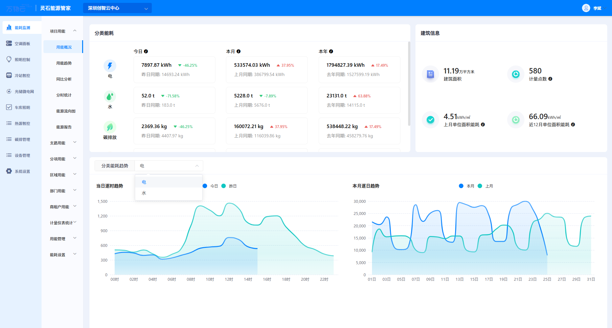
*用能概况页面原型*

**字段与数据说明：**

| 区块         | 字段                | 说明                         | 数据类型 | 单位    | 取值/格式         | 是否可为空 | 默认值 | 备注           |
|--------------|---------------------|------------------------------|----------|---------|-------------------|------------|--------|----------------|
| 分类能耗卡片 | 电                  | 今日/本月/本年用电量         | number   | kWh     | ≥0                | 否         | 0      |                |
| 分类能耗卡片 | 水                  | 今日/本月/本年用水量         | number   | t       | ≥0                | 否         | 0      |                |
| 分类能耗卡片 | 碳排放              | 今日/本月/本年碳排放量       | number   | kg      | ≥0                | 否         | 0      | 按折标系数换算 |
| 分类能耗卡片 | 环比/同比百分比      | 与上期对比百分比              | number   | %       | 正负数            | 否         | 0      | 绿色下降红色上升 |
| 分类能耗卡片 | 上期数值            | 昨日/上月/去年同期            | number   | 同上    | ≥0                | 否         | 0      |                |
| 建筑信息卡片 | 建筑面积            | 项目建筑面积                 | number   | ㎡      | ≥0                | 否         | 0      |                |
| 建筑信息卡片 | 计量点数            | 能耗计量点数量               | number   |         | ≥0                | 否         | 0      |                |
| 建筑信息卡片 | 上月单位面积能耗    | 上月总能耗/建筑面积           | number   | kWh/㎡  | ≥0                | 否         | 0      |                |
| 建筑信息卡片 | 近12月单位面积能耗  | 近12月总能耗/建筑面积         | number   | kWh/㎡  | ≥0                | 否         | 0      |                |
| 能耗趋势图   | 能耗类型            | 下拉选择（电/水）             | string   |         | "电"/"水"         | 否         | 电     |                |
| 能耗趋势图   | 日期类型            | 今日/昨日、本月/上月          | string   |         |                   | 否         | 今日   |                |
| 能耗趋势图   | 能耗数值            | 按小时/天统计的能耗           | number   | kWh/t   | ≥0                | 否         | 0      |                |

**交互流程：**
1. 用户进入页面，默认展示当前项目、今日/本月/本年能耗数据及趋势。
2. 用户可通过顶部下拉切换项目，页面数据即时刷新。
3. 分类能耗趋势区，用户可下拉切换能耗类型（电/水），趋势图随之切换。
4. 趋势图支持切换今日/昨日、本月/上月对比，图例可单独显示/隐藏。
5. 鼠标悬浮于字段或图表节点，显示详细数值及说明。
6. 若无数据，卡片和图表显示“暂无数据”提示。

**数据口径与公式：**
- 今日/昨日/本月/上月/本年/去年：均以自然日/月/年为统计周期。
- 环比/同比百分比=（本期-上期）/上期×100%，如上期为0则显示“--”。
- 碳排放=电量×电折标系数+水量×水折标系数。
- 单位面积能耗=总能耗/建筑面积。

**异常与权限处理：**
- 无权限项目不在下拉列表中显示。
- 数据加载失败时，显示“数据加载失败，请重试”。
- 所有只读卡片和图表不可编辑。
- 仅有查看权限的用户可见本页面。

**导出规范：**
- 支持导出趋势图数据为Excel，字段包含：日期、能耗类型、数值、单位、统计口径、导出时间。
- 文件命名：用能概况趋势_导出_yyyyMMdd_HHmmss.xlsx

---

#### 1.2 用能统计

**界面描述优化：**
用能统计页面支持年、月、日多维度统计，用户可通过顶部筛选栏选择分类能耗类型（如电、水、气）及统计周期。页面主要分为趋势图和明细表两部分：

- **趋势图**：以柱状图形式直观展示所选周期内的能耗变化趋势，横轴为时间（小时/天/月），纵轴为能耗数值（kWh/t/m³）。
- **明细表**：详细列出各时间点的能耗数据，支持分页浏览，底部显示合计。明细表可一键导出为Excel，导出内容包含所有筛选条件、字段、单位及导出时间。
- 支持批量导出、分页展示，若无数据则显示“暂无数据”提示。

**界面示意图：**
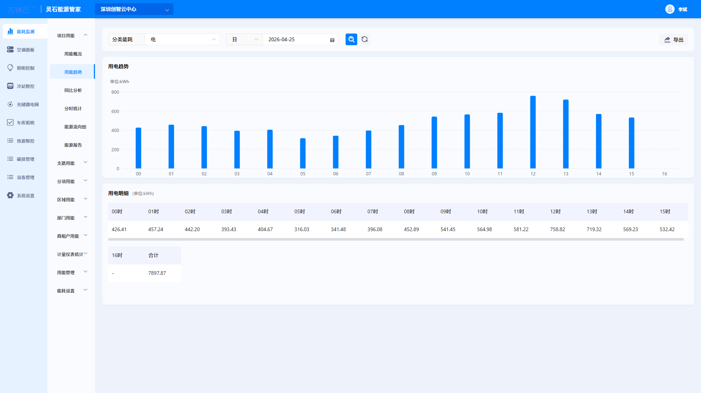
*用能统计页面原型*

**字段与数据说明：**

| 字段         | 说明             | 数据类型 | 单位   | 取值/格式 | 是否可为空 | 默认值 | 备注 |
|--------------|------------------|----------|--------|-----------|------------|--------|------|
| 分类能耗类型 | 能耗分类         | string   |        | 电/水/气  | 否         | 电     |      |
| 时间维度     | 统计周期         | string   |        | 年/月/日  | 否         | 日     |      |
| 用能数值     | 统计周期能耗     | number   | kWh/t/m³ | ≥0      | 否         | 0      |      |
| 明细表字段   | 详见导出Excel    | -        | -      | -         | -          | -      |      |

**交互流程：**
1. 用户选择能耗类型、时间维度，页面展示对应趋势图和明细表。
2. 明细表支持分页浏览和Excel导出。
3. 趋势图支持切换不同能耗类型和时间维度。
4. 若无数据，显示“暂无数据”提示。

**导出规范：**
- 导出文件包含所有筛选条件、字段、单位、导出时间。
- 文件命名：用能统计_导出_yyyyMMdd_HHmmss.xlsx

---

#### 1.3 同比分析

**界面描述优化：**
同比分析页面支持年、月、日多维度统计，用户可选择分类能耗类型（如电、水、气）及统计周期，系统自动对比本期与同期能耗。

- **对比柱状图**：以分组柱状图形式展示本期与同期各时间段能耗，横轴为时间（如月份），纵轴为能耗数值（kWh/t/m³），图例区分本期与同期。
- **明细表**：详细列出各时间段的本期能耗、同期能耗、增加值及同比百分比，支持分页浏览，显著标注同比增减趋势（如红色上升、绿色下降）。
- 支持一键导出Excel，导出内容包含所有筛选条件、字段、单位及导出时间。
- 若无数据则显示“暂无数据”提示。

**界面示意图：**
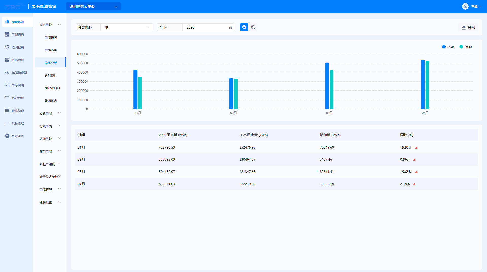
*项目用能同比分析原型*

**字段与数据说明：**

| 字段         | 说明             | 数据类型 | 单位   | 取值/格式 | 是否可为空 | 默认值 | 备注 |
|--------------|------------------|----------|--------|-----------|------------|--------|------|
| 分类能耗类型 | 能耗分类         | string   |        | 电/水/气  | 否         | 电     |      |
| 时间维度     | 统计周期         | string   |        | 年/月/日  | 否         | 日     |      |
| 本期能耗     | 当前周期能耗     | number   | kWh/t/m³ | ≥0      | 否         | 0      |      |
| 同期能耗     | 上年/上月/昨日能耗 | number   | kWh/t/m³ | ≥0     | 否         | 0      |      |
| 增加值       | 本期-同期         | number   | kWh/t/m³ | 可正可负 | 否         | 0      |      |
| 同比         | (本期-同期)/同期  | number   | %      | 正负数    | 否         | 0      |      |

**交互流程：**
1. 用户选择能耗类型、时间维度，页面展示本期与同期对比柱状图和明细表。
2. 明细表支持分页浏览和Excel导出。
3. 若无数据，显示“暂无数据”提示。

**导出规范：**
- 导出文件包含所有筛选条件、字段、单位、导出时间。
- 文件命名：同比分析_导出_yyyyMMdd_HHmmss.xlsx

---

#### 1.4 复费率报表

**界面示意图：**
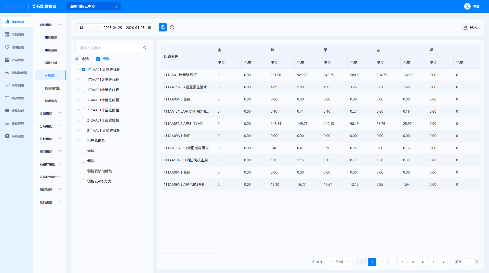
*复费率报表原型*

- 支持按年、月、日筛选，支路支持全选、多选、级联选择。
- 超过50条支路分页查询。
- 展示内容：分、峰、平、谷、深谷各时段电量、电费及合计。
- 支持批量导出，导出命名规范：复费率统计+时间范围。

**计算与统计细节优化：**
- 复费率报表的各时段电量、电费统计严格依据“系统设置-分时电价设置”中配置的分时段划分与单价。
- 支持每月、每年灵活调整分时段及单价，统计时自动适配对应时段规则。
- 电量统计按分时段累计，电费=各时段电量×对应时段单价，合计为所有时段电量与电费之和。
- 若分时电价设置有变更，历史报表可按变更前后分别统计，确保数据准确。

**字段与数据说明：**

| 字段         | 说明             | 数据类型 | 单位   | 取值/格式 | 是否可为空 | 默认值 | 备注 |
|--------------|------------------|----------|--------|-----------|------------|--------|------|
| 支路         | 支路名称         | string   |        |           | 否         | -      |      |
| 时间维度     | 统计周期         | string   |        | 年/月/日  | 否         | 日     |      |
| 尖/峰/平/谷/深谷电量 | 各时段电量 | number   | kWh    | ≥0        | 否         | 0      |      |
| 尖/峰/平/谷/深谷电费 | 各时段电费 | number   | 元     | ≥0        | 否         | 0      |      |
| 合计         | 总电量/总电费    | number   | kWh/元 | ≥0        | 否         | 0      |      |

**交互流程：**
1. 用户选择时间维度、支路，页面展示各时段电量、电费明细。
2. 支持多选、全选、级联选择支路，超50条分页。
3. 明细表支持分页浏览和Excel导出。
4. 若无数据，显示“暂无数据”提示。

**导出规范：**
- 导出文件包含所有筛选条件、字段、单位、导出时间。
- 文件命名：复费率报表_导出_yyyyMMdd_HHmmss.xlsx

---

#### 1.5 能源流向图

**界面示意图：**

*能源流向图原型*

- 展示项目各级支路能耗流向，支持按分类能耗切换。
- 支持自动生成（按支路层级）和手动配置（自定义层级与公式）。
- 展示设备名称、编码、回路名称、上级回路、节点属性等。

| 字段         | 说明             | 数据类型 | 单位   | 取值/格式 | 是否可为空 | 默认值 | 备注 |
|--------------|------------------|----------|--------|-----------|------------|--------|------|
| 能耗分类     | 分类名称         | string   |        | 电/水/气  | 否         | 电     |      |
| 层级         | 支路层级         | string   |        | 一级/二级/三级等 | 否   | 一级   |      |
| 设备名称     | 设备名称         | string   |        |           | 否         | -      |      |
| 设备编码     | 设备编码         | string   |        |           | 否         | -      |      |
| 回路名称     | 回路名称         | string   |        |           | 否         | -      |      |
| 上级回路     | 上级回路名称     | string   |        |           | 否         | -      |      |
| 节点属性     | 节点属性         | string   |        | 一级/二级/三级等 | 否   | 一级   |      |

**交互流程：**
1. 用户选择能耗分类，页面展示对应能源流向图。
2. 支持自动生成和手动配置流向关系。
3. 支持导出流向图数据。
4. 若无数据，显示“暂无数据”提示。

**导出规范：**
- 导出文件包含所有筛选条件、字段、单位、导出时间。
- 文件命名：能源流向图_导出_yyyyMMdd_HHmmss.xlsx

---

## 2. 支路用能

### 2.1 用能统计

**界面示意图：**
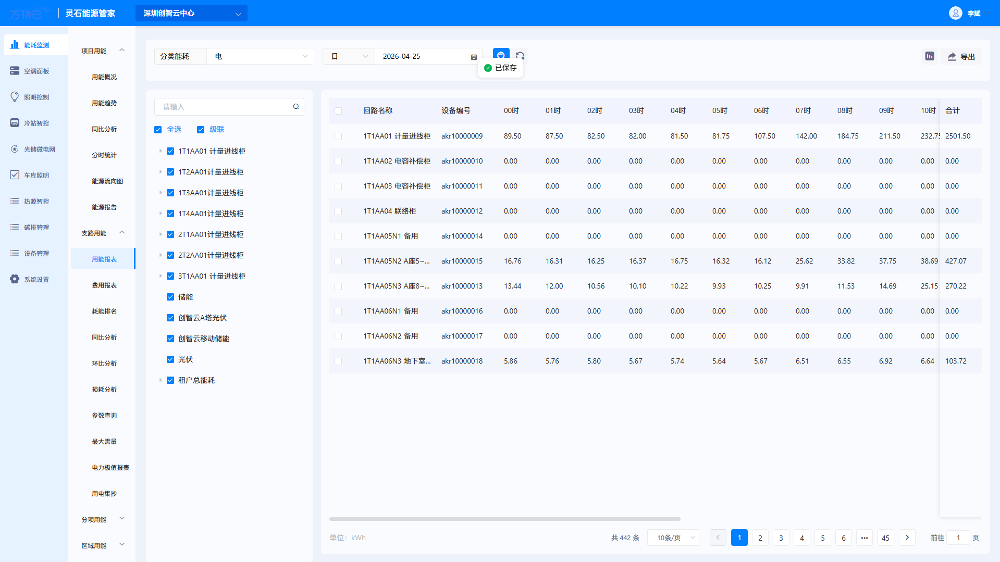
*支路用能统计原型*

- 按分类能耗、时间、支路筛选，支持全选、多选、级联、分页。
- 展示内容：用能明细、趋势图，支持批量导出。

### 2.2 费用报表

**界面示意图：**
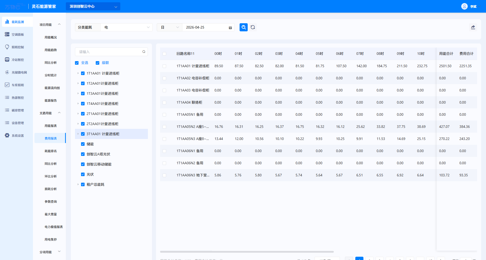
*支路用能费用报表原型*

- 按分类能耗、时间、支路筛选，展示能耗明细、单位、单价、费用合计。
- 单价来源：系统设置。
- 支持批量导出。

### 2.3 同比/环比分析

**界面示意图：**
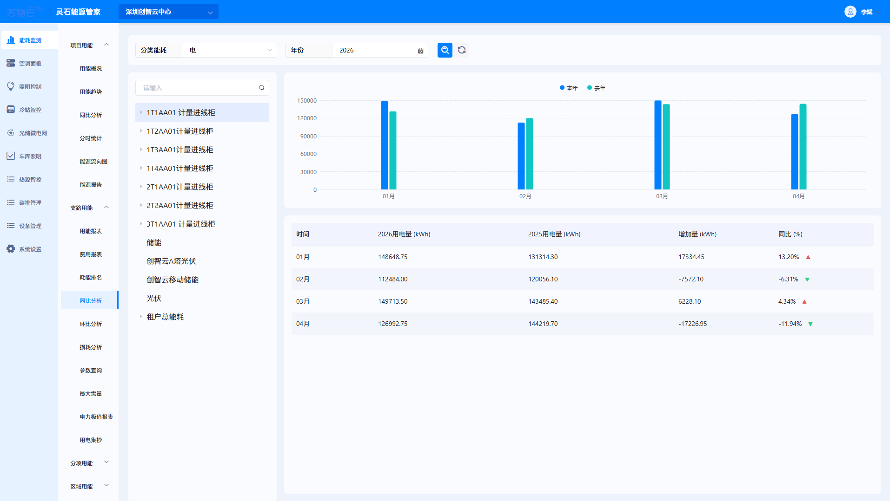
*支路用能同比分析原型*

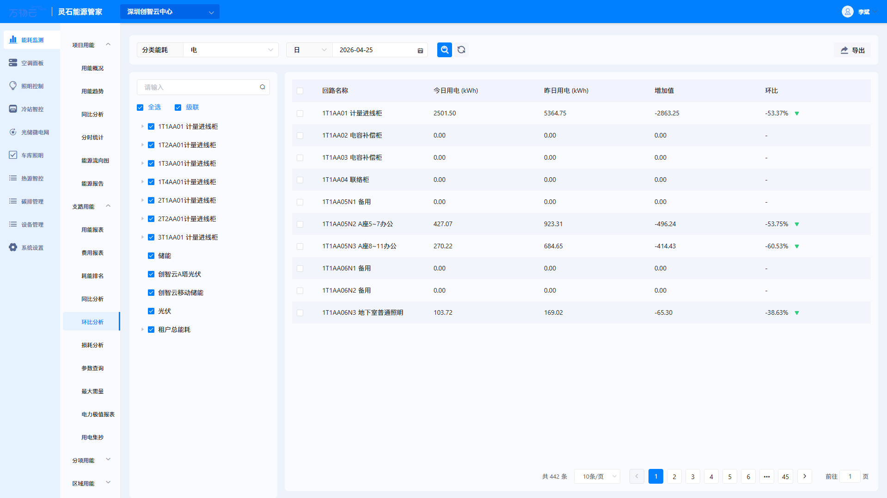
*支路用能环比分析原型*

- 同比：按年、月、日对比本期与同期能耗，图表与明细。
- 环比：按分类能耗、时间、支路筛选，展示回路名称、当期/上期能耗、增加值、环比。
- 支持批量导出。

### 2.4 损耗分析

**界面示意图：**
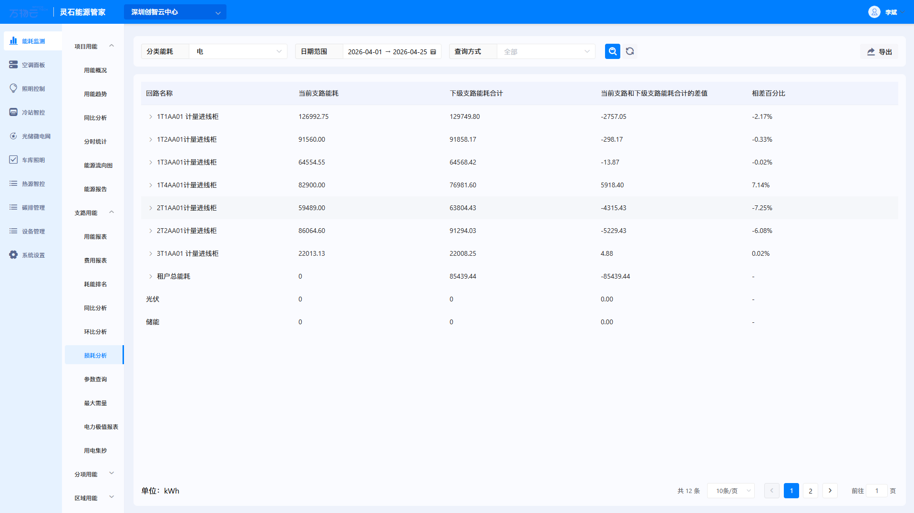
*支路用能损耗分析原型*

- 按分类能耗、时间范围、查询方式（分级/全部），支路支持模糊查询、多选。
- 展示回路名称、当前支路能耗、下级支路能耗合计、差值、相差百分比。
- 支持批量导出。

### 2.5 参数查询/报表

**界面示意图：**
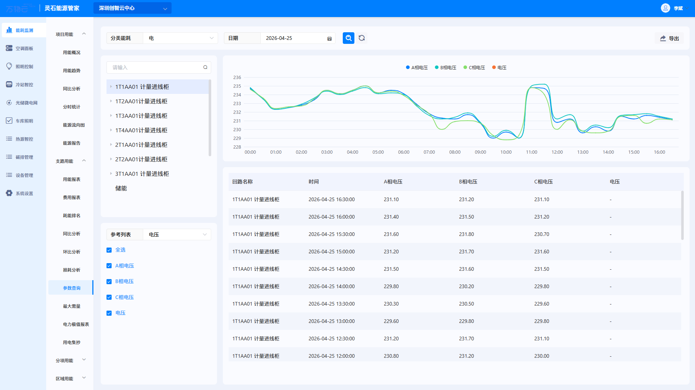
*支路用能参数查询原型*

- 选择分类能耗、日期、支路、参数，展示参数曲线与列表。
- 支持多参数、多时段，支持导出。

### 2.6 最大需量

- 按时间段、支路筛选，统计每月最大需量及发生时间。
- 支持批量导出。

### 2.7 能耗排名

**界面示意图：**
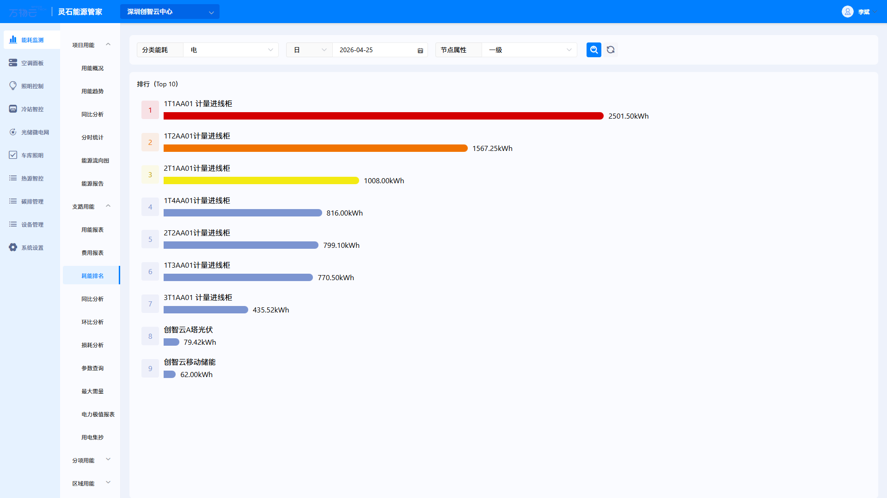
*支路用能能耗排名原型*

- 按分类能耗、日期、节点属性统计支路能耗排名，展示Top10。
- 展示能耗值、排名，支持图表与明细。

## 3. 部门用能

### 3.1 用能统计/费用报表

- 按分类能耗、时间、部门筛选，支持全选、多选、级联、默认选第一个部门。
- 展示能耗明细、单位、单价、用能合计、费用合计。
- 支持批量导出。

### 3.2 同比分析/能耗排名

- 同比：按分类能耗、时间、部门维度对比本年/上年能耗，图表与明细。
- 排名：按节点属性统计部门能耗排名，展示Top10。

## 4. 区域用能

### 4.1 用能统计/费用报表

**界面示意图：**
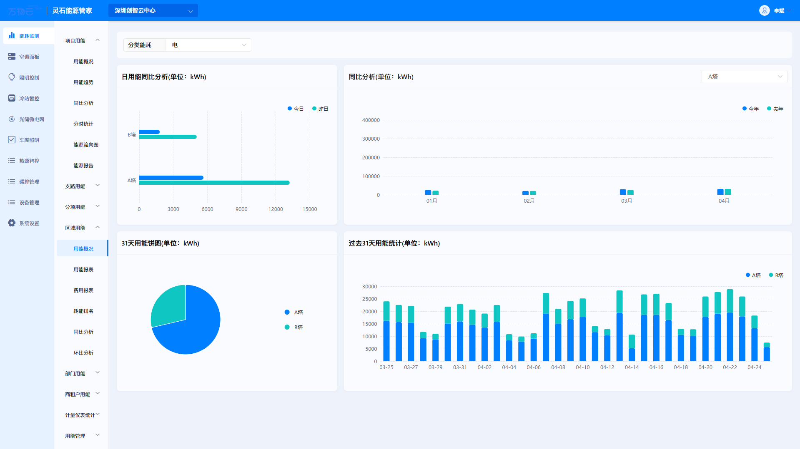
*区域用能概况原型*

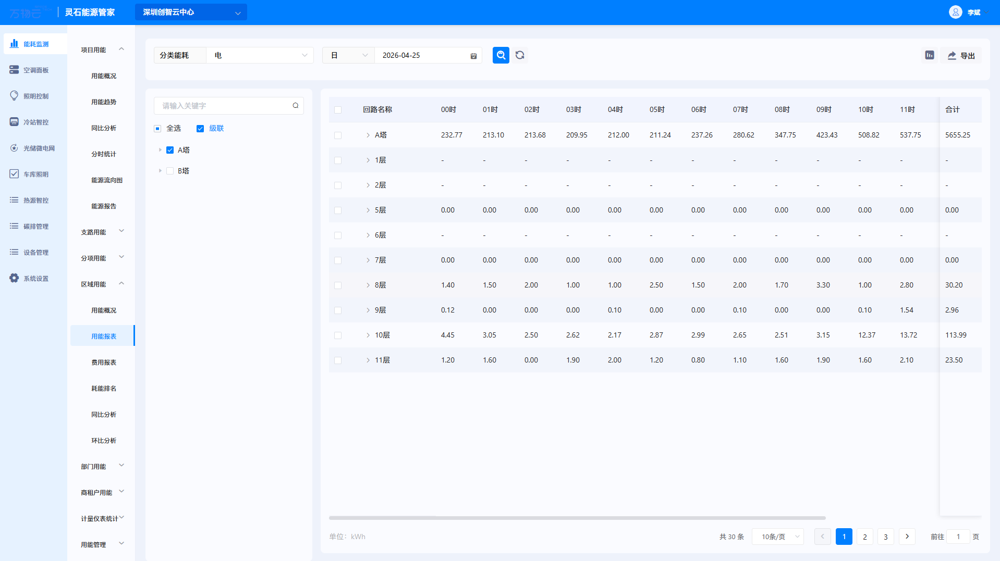
*区域用能报表原型*

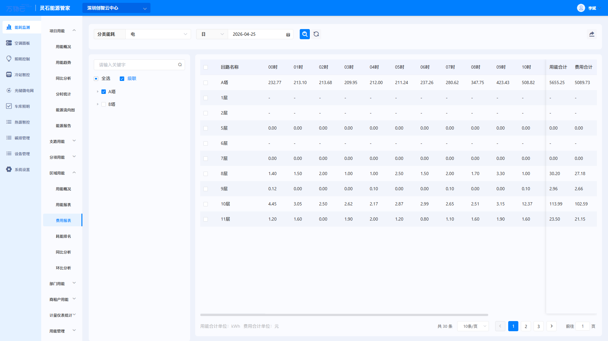
*区域用能费用报表原型*

- 按分类能耗、时间、区域筛选，支持全选、多选、级联、默认选第一个区域。
- 展示能耗明细、单位、单价、用能合计、费用合计。
- 支持批量导出。

### 4.2 同比分析/能耗排名

- 同比：按分类能耗、时间、区域维度对比本年/上年能耗，图表与明细。
- 排名：按节点属性统计区域能耗排名，展示Top10。

## 5. 分项用能

### 5.1 用能统计/同比分析

**界面示意图：**
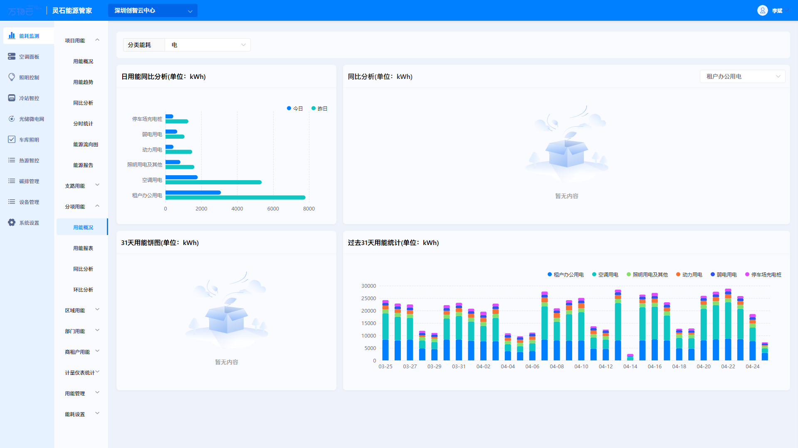
*分项用能概况原型*

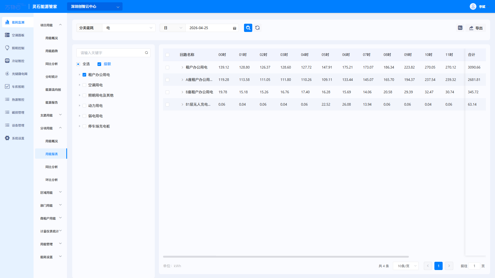
*分项用能报表原型*

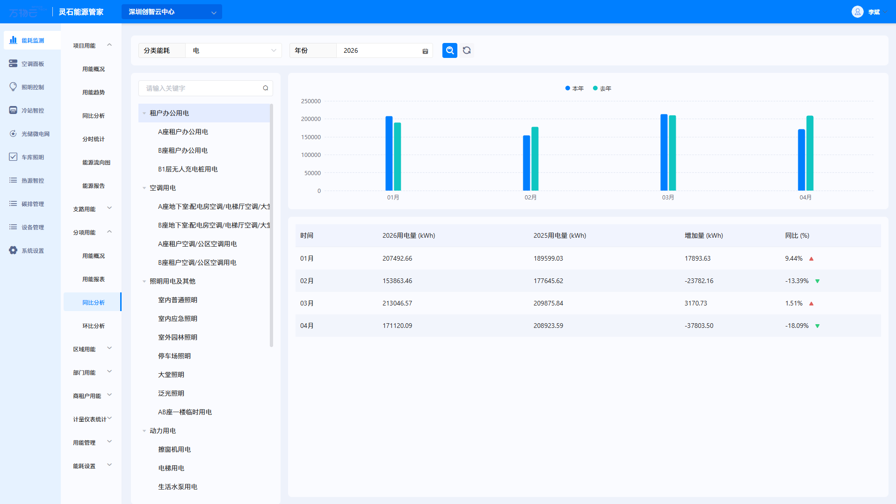
*分项用能同步分析原型*

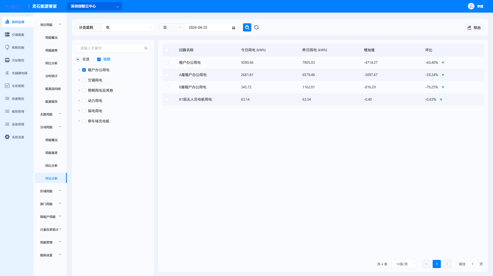
*分项用能环比分析原型*

- 按分类能耗、年月日、分项筛选，支持全选、级联、默认全选。
- 展示用能明细、趋势图、同比分析，支持批量导出。

## 6. 商租户用能

### 6.1 用能统计/费用报表/同比分析/环比分析/能耗排名

- 参照部门用能功能，支持商租户树结构、批量导出。

## 7. 系统设置

### 7.x 产品管理

产品管理用于维护能源管家系统中的产品信息，实现与IOT平台和基础数据的对接。

- 每个产品在IOT平台有唯一的productKey，在基础数据中有唯一的产品编码。
- 能源管家需根据产品编码从基础数据同步产品台账，确保产品信息一致。
- 系统会根据产品的productKey订阅和消费IOT平台推送的该产品消息，实现设备数据的实时采集与处理。
- 在能耗统计时，需明确每个产品对应的能耗分类（如电、水、气、热等），以便于数据归类与统计分析。
- 支持产品的新增、编辑、删除及批量同步。

**界面示意图：**
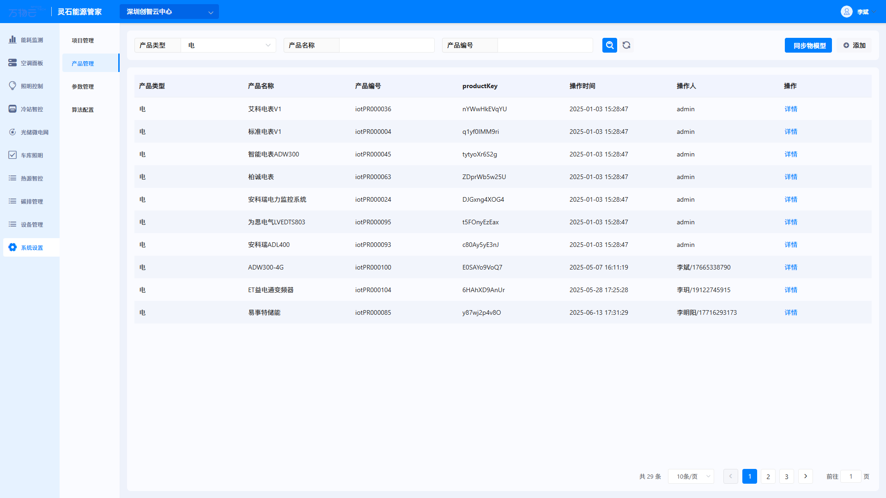
*产品管理原型*
### 7.x 项目设置

项目设置用于管理能源管家产品的基础数据信息，包括空间信息、区域、部门、商租户、设备台账等。

- 新建能源管家项目时，必须先在“系统设置-项目管理”中选择已有的基础数据项目进行添加。
- 添加后，系统会自动初始化并同步一次所有基础数据，确保项目空间、区域、部门、商租户、设备台账等信息与基础数据保持一致。
- 支持后续手动同步基础数据，保证数据实时更新。

**界面示意图：**
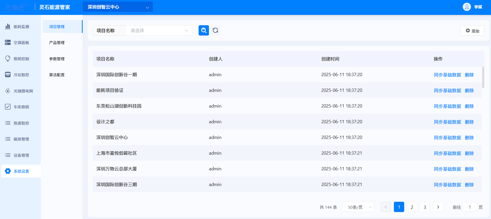
*项目设置原型*

### 7.1 系统基础参数配置

- 支持配置项目的能源类型（如电、水、气、热等），可灵活增减。
- 支持碳排放因子和标准煤折算因子的设置，精确到四位小数，单位kg。
- 支持项目基本电费计价方式配置（如容量法、需量法等）。
- 新增项目时，自动初始化能耗类型为电，并自动初始化折标煤与碳排放因子。
- 支持批量导入、导出基础参数配置。

**界面示意图：**
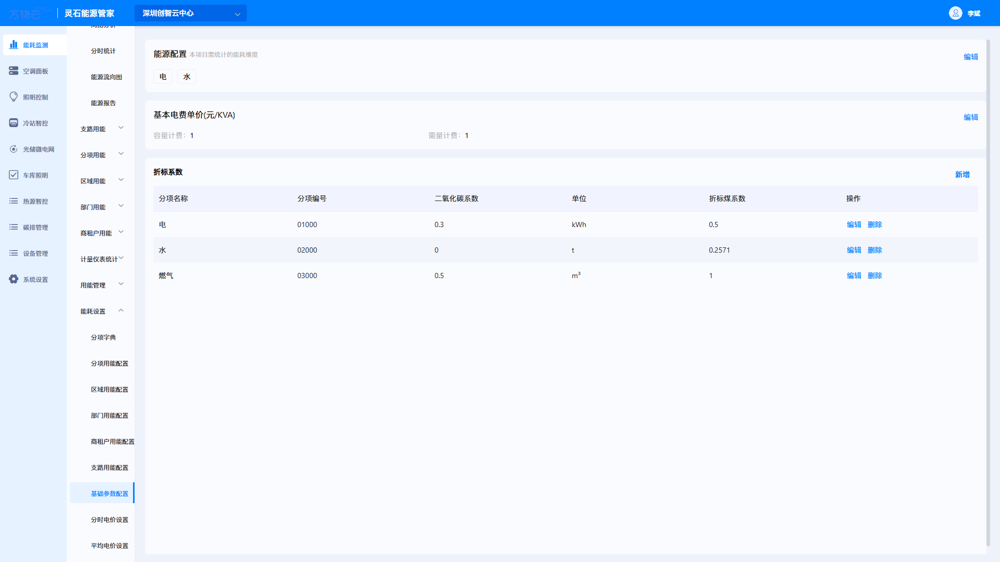
*系统基础参数配置原型*

### 7.2 折标煤与碳排放因子设置

- 支持对各能源类型的碳排放因子、标准煤折算系数进行独立配置。
- 可针对不同项目灵活调整，支持编辑、删除。
- 所有因子均支持精确到四位小数，单位为kg。
- 配置项在新建项目时自动初始化，后续可按需调整。

### 7.3 分时电价设置

分时电价设置用于灵活配置各项目的分时电价及计价时间段，满足不同季节、月份、政策的电价管理需求。

- 支持设置尖、峰、平、谷等多个时段的电价单价，并可自定义时段划分。
- 支持按月度、年度、时段等多维度配置分时电价，可批量设置多个时间段，提升配置效率。
- 分时电价设置可批量导入、导出，便于大规模项目统一管理。
- 分时统计功能（如项目分时统计、分时电量统计）将严格依据本设置的时段与电价进行能耗与费用统计，确保统计口径一致。

**界面示意图：**
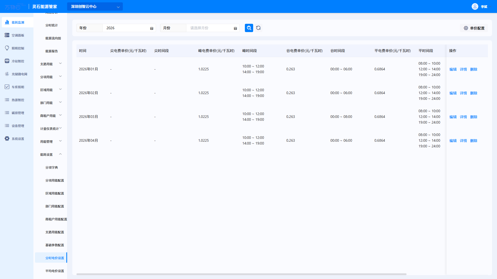
*分时电价时段设置原型*

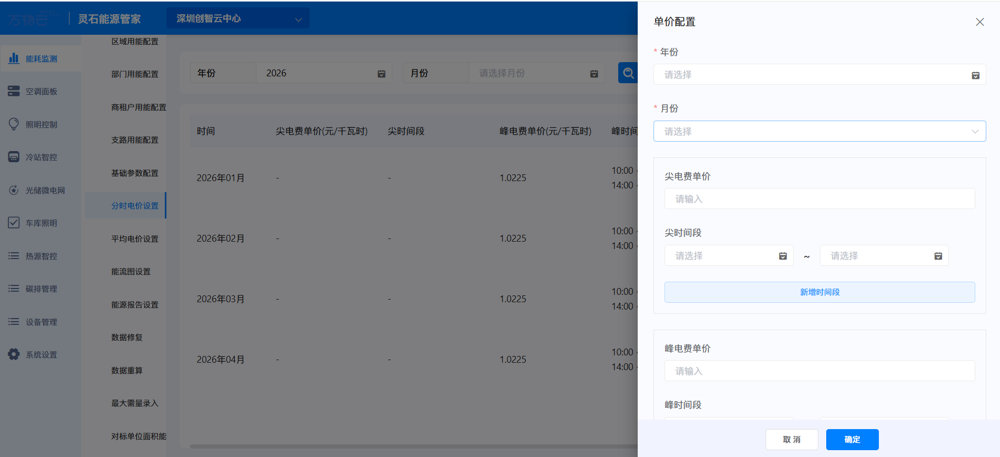
*分时电价单价配置原型*

### 7.4 支路用能配置

支路用能配置用于管理项目内所有支路的能耗统计关系，确保能耗数据的准确归集和分层统计。

- 支持以树结构、级联方式维护支路层级关系，便于展示支路树、损耗分析和自动生成能流图。
- 支持添加、编辑支路，配置仪表倍率（用于能耗数据换算）、是否主回路（主回路数据计入项目总能耗）。
- 可设置支路的上级回路，实现多级支路的归属与统计。
- 支持批量导入、导出支路配置，便于大规模项目快速初始化。
- 支持模糊查询、上级回路快速定位。

**界面示意图：**
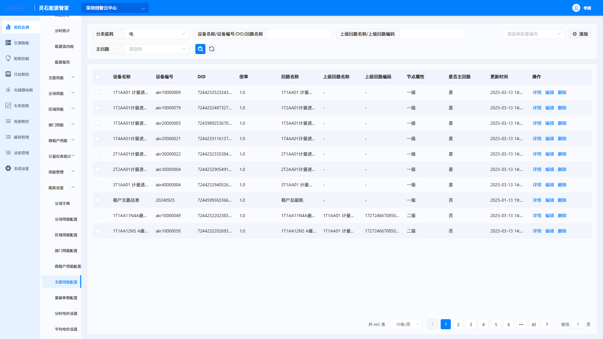
*支路用能配置原型*

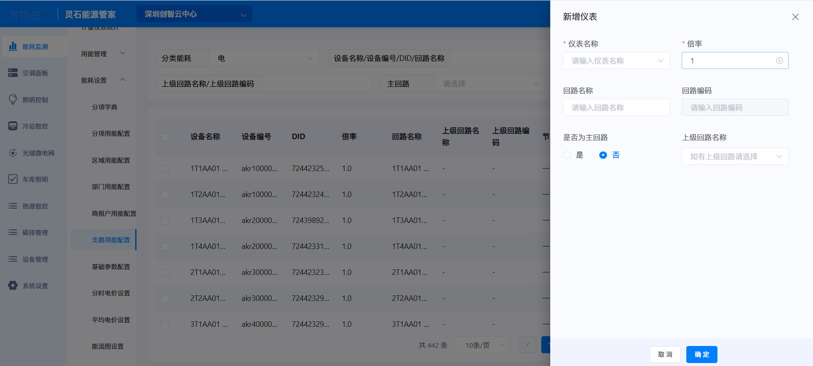
*添加支路原型*

### 7.x 分项用能配置

分项用能配置用于维护各分项的能耗归集关系，实现能耗数据的细分统计。

- 所属分项取自分项字典，确保统计口径统一。
- 支持为每个分项配置对应设备等能耗来源，便于后续分项能耗统计和分析。
- 支持批量导入、导出分项用能配置，便于大规模项目快速初始化。

**界面示意图：**
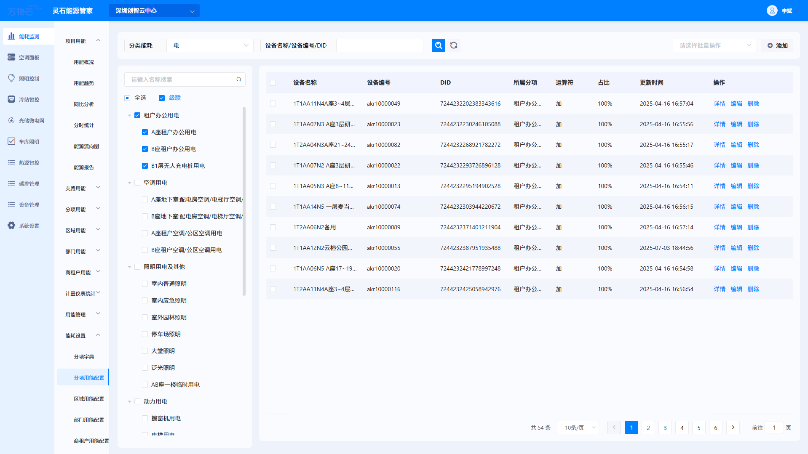
*分项用能配置原型*

### 7.x 区域用能配置

区域用能配置用于维护各区域的能耗归集关系，实现区域维度的能耗统计。

- 区域信息来源于基础数据，确保与项目空间结构一致。
- 支持为每个区域配置对应的设备等能耗来源，便于后续区域能耗统计和分析。
- 支持批量导入、导出区域用能配置，便于大规模项目快速初始化。

**界面示意图：**
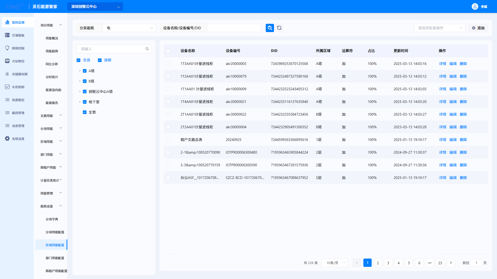
*区域用能配置原型*

### 7.x 商租户用能配置

商租户用能配置用于维护各商租户的能耗归集关系，实现租户维度的能耗统计。

- 商租户信息来源于基础数据，确保与实际租赁结构一致。
- 支持为每个商租户配置对应的设备等能耗来源，便于后续商租户能耗统计和分析。
- 支持批量导入、导出商租户用能配置，便于大规模项目快速初始化。

**界面示意图：**
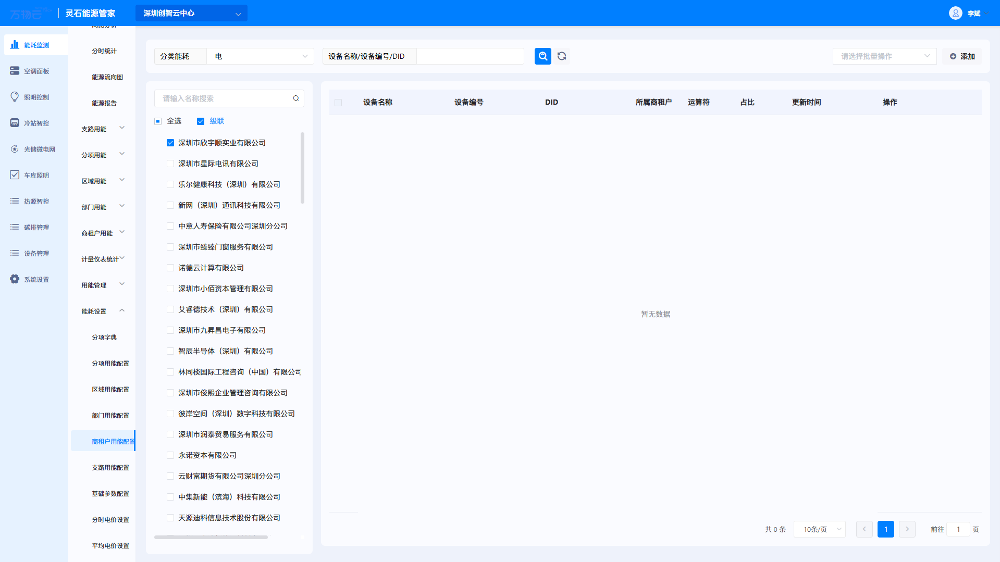
*商租户用能配置原型*

### 7.x 部门用能设置

部门用能设置用于维护各部门的能耗归集关系，实现部门维度的能耗统计。

- 部门信息来源于基础数据，确保与组织架构一致。
- 支持为每个部门配置对应的设备等能耗来源，便于后续部门能耗统计和分析。
- 支持批量导入、导出部门用能设置，便于大规模项目快速初始化。

**界面示意图：**
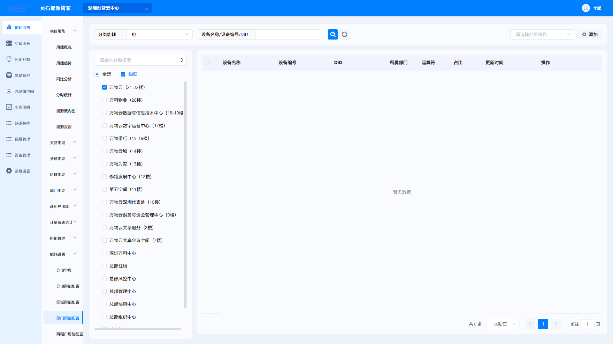
*部门用能设置原型*
### 7.x 分项字典

分项字典用于配置和维护项目内所有能耗分项类型，便于能耗数据的细分统计和归类。

- 支持自定义添加、编辑、删除分项类型，满足不同项目的实际需求。
- 系统初始化时会自动生成一批常用分项（如照明、动力、空调、特殊用能等），用户可在此基础上扩展或调整。
- 分项字典作为分项用能统计、报表等功能的数据基础，所有分项统计均以此为准。

**界面示意图：**
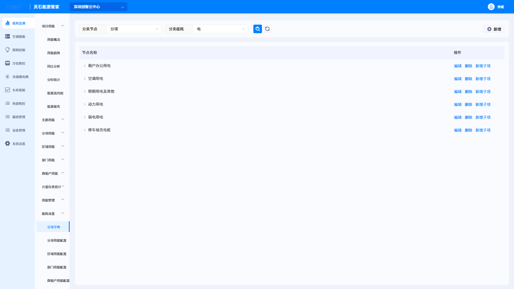
*分项字典原型*

### 7.6 能流图设置

能流图设置用于配置和生成项目的能源流向图，直观反映各支路、设备间的能耗流向关系。

- 支持两种模式：
  - 默认自动生成：系统根据支路的层级关系自动生成能流图，快速搭建基础能流结构。
  - 手动配置：用户可自定义能流节点，灵活调整能流结构。
- 手动配置流程：
  1. 新增能流节点（如变压器、配电箱等），每个节点可自定义名称、类型、属性等。
  2. 将计量仪表与能流节点进行关联，并可设置每个仪表在节点中的占比、运算符（如加、减、乘、除等）。
  3. 节点的能耗值按所绑定仪表的实时数据及占比、运算符进行自动计算。
  4. 支持多级节点、复杂能流关系的灵活配置。
- 能流图配置完成后，最终生成的能源流向图将在“项目用能-能源流向图”页面进行可视化展示，便于用户直观分析各环节能耗分布。
- 支持能流图的批量导入、导出，便于大项目快速初始化和迁移。

**界面示意图：**
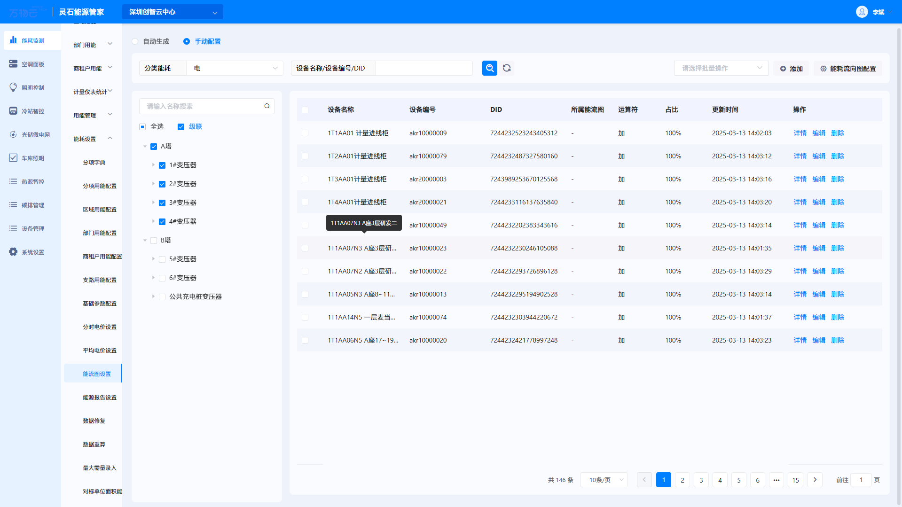
*能流图设置原型*

*能流图新增节点原型*

**能流图展示示意：**
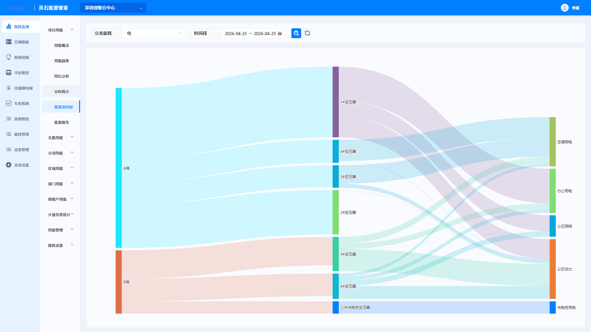
*项目用能-能源流向图展示原型*

## 8. 设备台账与告警管理

### 8.1 设备台账

- 展示设备信息、状态（在线/离线/未激活）、实时读数、位置、倍率，支持导出。
- 支持按分类能耗、设备名称/编码/DID、状态筛选。

### 8.2 设备离线告警

- 离线状态监测，记录报警开始/结束时间、当前状态、手动关闭、自动恢复。
- 支持导出、批量处理。

### 8.3 能源定额/参数越限告警

- 支持按报警类型、事件类型、报警等级、能源节点类型、名称等筛选。
- 支持多条件、分级、批量配置、告警记录与处理。

## 9. 数据重算与修复

### 9.1 数据重算

- 针对异常时段，支持多维度（支路、分项、部门、区域等）数据重算。
- 任务管理：记录任务ID、统计起止时间、创建/完成时间、状态、详情。

### 9.2 数据修复

- 支持批量导入、导出、模板校验、历史数据修复。
- 支持按设备类型、产品名称、属性、时间段筛选导出/导入。

## 10. 曲线分析

### 10.1 多设备多参数曲线分析

- 支持左侧产品-设备-属性树选择，最多20条曲线。
- 时间筛选支持日、周、月、年、自定义，支持多时间间隔。
- 支持模板保存、批量导出。

---

## 三、通用约束与说明

1. 支持多维度、多层级、批量导出、分页、级联选择、模糊查询等操作体验优化。
2. 支持多终端（PC、大屏、移动端）实时同步。
3. 具备权限管理、数据安全、日志追溯等基础能力。
4. 所有导出文件需包含导出时间、筛选条件、数据单位等元信息。
5. 所有统计、分析、排名等数据需注明统计口径、时间范围。
6. 所有配置、录入、修正等操作需有操作日志记录。